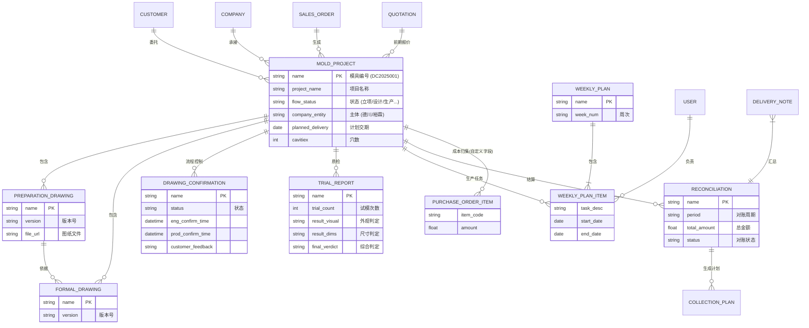

# 德川/裕霖业务管理系统 - 数据库 ER 图

本图描述了系统核心实体及其关系，特别是自定义新增的业务对象与 ERPNext 原生对象的关联。

## 说明

1.  **MOLD_PROJECT (模具项目)** 是全系统的核心枢纽，几乎所有业务单据都通过外键（`Link` 字段）与其关联。
2.  **工程管理** 采用 `Drawing` -> `Confirmation` 的分离设计，版本文件与确认流程解耦，支持多次确认。
3.  **成本归集** 并不创建独立的成本表，而是通过在 `Purchase Order Item` (原生) 上添加 `mold_project` 字段来实现动态汇总。
4.  **对账管理** `Reconciliation` 是一个新的实体，用于在 `Delivery Note` (原生送货单) 和 `Payment Entry` (原生收款) 之间建立一个确认层。
