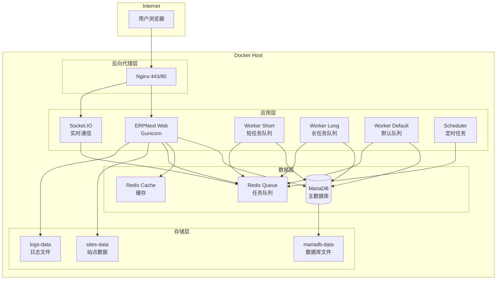

# ERPNext Docker 部署指南

> 德川/裕霖业务管理系统 - 容器化生产部署文档

---

## 文档信息

| 项目 | 内容 |
|------|------|
| 项目名称 | 德川/裕霖业务管理系统 |
| 文档版本 | V1.0 |
| 编写日期 | 2026-01-16 |
| 适用平台 | Docker / Docker Compose |
| 文档状态 | 正式版 |

---

## 目录

1. [概述](#1-概述)
2. [系统要求](#2-系统要求)
3. [架构说明](#3-架构说明)
4. [快速开始](#4-快速开始)
5. [配置说明](#5-配置说明)
6. [部署步骤](#6-部署步骤)
7. [运维管理](#7-运维管理)
8. [备份与恢复](#8-备份与恢复)
9. [监控与日志](#9-监控与日志)
10. [故障排查](#10-故障排查)
11. [安全加固](#11-安全加固)
12. [升级指南](#12-升级指南)
13. [常见问题](#13-常见问题)

---

## 1. 概述

### 1.1 文档目的

本文档旨在指导运维团队使用 Docker 容器化方式部署 ERPNext 生产环境，包含德川定制模块和 AI Agent 功能。

### 1.2 部署优势

| 优势 | 说明 |
|------|------|
| **环境一致性** | 开发、测试、生产环境完全一致 |
| **快速部署** | 一键启动所有服务 |
| **易于扩展** | 支持水平扩展 Worker 节点 |
| **便于维护** | 独立容器，互不影响 |
| **简化备份** | 数据卷统一管理 |

### 1.3 目录结构

```
/Users/apple/erpnext/
├── docker/                          # Docker部署目录
│   ├── docker-compose.yml           # 开发环境配置
│   ├── docker-compose.prod.yml      # 生产环境配置
│   ├── Dockerfile                   # 自定义ERPNext镜像
│   ├── env.example                  # 环境变量模板
│   ├── nginx/
│   │   ├── nginx.conf              # Nginx主配置
│   │   ├── conf.d/                 # 额外配置目录
│   │   └── ssl/                    # SSL证书目录
│   └── scripts/
│       ├── init.sh                 # 初始化脚本
│       ├── backup.sh               # 备份脚本
│       └── restore.sh              # 恢复脚本
├── erpnext/                         # ERPNext源码
│   └── dechuan/                    # 德川定制模块
└── docs/
    └── DOCKER_DEPLOYMENT_GUIDE.md  # 本文档
```

---

## 2. 系统要求

### 2.1 硬件要求

| 配置项 | 最低要求 | 推荐配置 |
|--------|----------|----------|
| CPU | 2核 | 4核+ |
| 内存 | 4GB | 8GB+ |
| 磁盘 | 50GB SSD | 100GB+ SSD |
| 网络 | 10Mbps | 100Mbps+ |

### 2.2 软件要求

| 软件 | 版本要求 | 说明 |
|------|----------|------|
| 操作系统 | Ubuntu 22.04 LTS / CentOS 8+ | 推荐Ubuntu |
| Docker | 24.0+ | 必需 |
| Docker Compose | 2.20+ | 必需（V2版本） |
| Git | 2.0+ | 拉取代码 |

### 2.3 网络要求

| 端口 | 服务 | 说明 |
|------|------|------|
| 80 | HTTP | 重定向到HTTPS |
| 443 | HTTPS | 主服务端口 |
| 3306 | MariaDB | 仅内部访问 |
| 6379 | Redis | 仅内部访问 |
| 8000 | Gunicorn | 仅内部访问 |
| 9000 | Socket.IO | 仅内部访问 |

---

## 3. 架构说明

### 3.1 系统架构图



### 3.2 容器说明

| 容器名称 | 镜像 | 职责 |
|----------|------|------|
| `erpnext-mariadb` | mariadb:10.6 | 数据库服务 |
| `erpnext-redis-cache` | redis:7-alpine | 缓存服务 |
| `erpnext-redis-queue` | redis:7-alpine | 队列服务 |
| `erpnext-web` | 自定义镜像 | Web服务（Gunicorn） |
| `erpnext-socketio` | 自定义镜像 | 实时通信 |
| `erpnext-worker-short` | 自定义镜像 | 短任务Worker |
| `erpnext-worker-long` | 自定义镜像 | 长任务Worker |
| `erpnext-worker-default` | 自定义镜像 | 默认队列Worker |
| `erpnext-scheduler` | 自定义镜像 | 定时任务调度 |
| `erpnext-nginx` | nginx:1.25-alpine | 反向代理 |

---

## 4. 快速开始

### 4.1 安装Docker

```bash
# Ubuntu/Debian
curl -fsSL https://get.docker.com | sh
sudo usermod -aG docker $USER

# 安装Docker Compose插件
sudo apt update
sudo apt install docker-compose-plugin

# 验证安装
docker --version
docker compose version
```

### 4.2 克隆项目

```bash
# 克隆代码仓库
git clone <your-repo-url> /opt/erpnext
cd /opt/erpnext/docker
```

### 4.3 配置环境变量

```bash
# 复制环境变量模板
cp env.example .env

# 编辑配置文件
vim .env
```

**必须配置的变量**：

```bash
# 站点域名
SITE_NAME=erp.your-domain.com

# 数据库密码（请使用强密码）
MYSQL_ROOT_PASSWORD=YourSecureRootPassword123!
MYSQL_PASSWORD=YourSecureDBPassword123!

# 管理员密码
ADMIN_PASSWORD=YourSecureAdminPassword123!

# AI Agent配置（可选）
OPENAI_API_KEY=sk-xxx
DEEPSEEK_API_KEY=xxx
```

### 4.4 一键部署

```bash
# 运行初始化脚本
./scripts/init.sh
```

### 4.5 访问系统

部署完成后，访问 `https://erp.your-domain.com`

- **管理员账号**：Administrator
- **管理员密码**：您在 `.env` 中配置的 `ADMIN_PASSWORD`

---

## 5. 配置说明

### 5.1 环境变量详解

#### 基础配置

| 变量名 | 说明 | 示例值 |
|--------|------|--------|
| `COMPOSE_PROJECT_NAME` | 项目名称前缀 | erpnext-dechuan |
| `ENVIRONMENT` | 运行环境 | production |
| `SITE_NAME` | 站点域名 | erp.dechuan.com |

#### 数据库配置

| 变量名 | 说明 | 示例值 |
|--------|------|--------|
| `MYSQL_ROOT_PASSWORD` | Root密码 | 强密码 |
| `MYSQL_DATABASE` | 数据库名 | erpnext |
| `MYSQL_USER` | 数据库用户 | erpnext |
| `MYSQL_PASSWORD` | 用户密码 | 强密码 |

#### AI Agent 配置

| 变量名 | 说明 | 示例值 |
|--------|------|--------|
| `OPENAI_API_KEY` | OpenAI密钥 | sk-xxx |
| `DEEPSEEK_API_KEY` | DeepSeek密钥 | xxx |
| `WECHAT_CORP_ID` | 企业微信ID | wwxxx |
| `WECHAT_CORP_SECRET` | 企业微信Secret | xxx |

#### 性能配置

| 变量名 | 说明 | 推荐值 |
|--------|------|--------|
| `GUNICORN_WORKERS` | Worker数量 | CPU核心数×2+1 |
| `WORKER_TIMEOUT` | 超时时间(秒) | 120 |

### 5.2 资源限制

在 `docker-compose.prod.yml` 中配置了各容器的资源限制：

| 容器 | 内存限制 | 内存预留 |
|------|----------|----------|
| MariaDB | 2GB | 1GB |
| Redis Cache | 768MB | 256MB |
| Redis Queue | 512MB | 128MB |
| ERPNext Web | 2GB | 1GB |
| Workers | 1-2GB | 256-512MB |
| Nginx | 256MB | 64MB |

---

## 6. 部署步骤

### 6.1 准备工作

```bash
# 1. 创建部署目录
sudo mkdir -p /opt/erpnext
sudo chown -R $USER:$USER /opt/erpnext

# 2. 克隆代码
cd /opt/erpnext
git clone <repo-url> .

# 3. 创建数据目录
sudo mkdir -p /var/lib/erpnext/{mariadb,sites,logs}
sudo chown -R 1000:1000 /var/lib/erpnext/sites
sudo chown -R 1000:1000 /var/lib/erpnext/logs
sudo chown -R 999:999 /var/lib/erpnext/mariadb
```

### 6.2 配置SSL证书

#### 方式一：使用Let's Encrypt（推荐）

```bash
# 安装certbot
sudo apt install certbot

# 获取证书（需要先停止nginx或使用DNS验证）
sudo certbot certonly --standalone -d erp.your-domain.com

# 复制证书到nginx目录
sudo cp /etc/letsencrypt/live/erp.your-domain.com/fullchain.pem docker/nginx/ssl/
sudo cp /etc/letsencrypt/live/erp.your-domain.com/privkey.pem docker/nginx/ssl/
```

#### 方式二：使用自签名证书（测试用）

```bash
# 初始化脚本会自动生成自签名证书
./scripts/init.sh
```

### 6.3 构建镜像

```bash
cd /opt/erpnext/docker

# 构建生产镜像
docker compose -f docker-compose.prod.yml build
```

### 6.4 启动服务

```bash
# 启动所有服务
docker compose -f docker-compose.prod.yml up -d

# 查看服务状态
docker compose -f docker-compose.prod.yml ps

# 查看日志
docker compose -f docker-compose.prod.yml logs -f
```

### 6.5 初始化站点

如果是首次部署，需要创建站点：

```bash
# 创建新站点
docker compose -f docker-compose.prod.yml exec erpnext-web \
    bench new-site erp.your-domain.com \
    --db-root-password $MYSQL_ROOT_PASSWORD \
    --admin-password $ADMIN_PASSWORD \
    --no-mariadb-socket

# 安装ERPNext
docker compose -f docker-compose.prod.yml exec erpnext-web \
    bench --site erp.your-domain.com install-app erpnext

# 设置为默认站点
docker compose -f docker-compose.prod.yml exec erpnext-web \
    bench use erp.your-domain.com

# 运行迁移
docker compose -f docker-compose.prod.yml exec erpnext-web \
    bench --site erp.your-domain.com migrate
```

---

## 7. 运维管理

### 7.1 常用命令

#### 服务管理

```bash
# 启动所有服务
docker compose -f docker-compose.prod.yml up -d

# 停止所有服务
docker compose -f docker-compose.prod.yml down

# 重启指定服务
docker compose -f docker-compose.prod.yml restart erpnext-web

# 查看服务状态
docker compose -f docker-compose.prod.yml ps

# 查看服务日志
docker compose -f docker-compose.prod.yml logs -f erpnext-web
```

#### Bench命令

```bash
# 进入容器执行bench命令
docker compose -f docker-compose.prod.yml exec erpnext-web bash

# 或直接执行
docker compose -f docker-compose.prod.yml exec erpnext-web \
    bench --site $SITE_NAME <command>
```

#### 常用Bench命令

| 命令 | 说明 |
|------|------|
| `bench migrate` | 数据库迁移 |
| `bench build --production` | 构建前端资源 |
| `bench clear-cache` | 清理缓存 |
| `bench set-config key value` | 设置配置 |
| `bench console` | Python交互式终端 |
| `bench mariadb` | MariaDB终端 |

### 7.2 更新部署

```bash
# 1. 拉取最新代码
cd /opt/erpnext
git pull origin main

# 2. 重新构建镜像
cd docker
docker compose -f docker-compose.prod.yml build

# 3. 重启服务
docker compose -f docker-compose.prod.yml up -d

# 4. 运行迁移
docker compose -f docker-compose.prod.yml exec erpnext-web \
    bench --site $SITE_NAME migrate

# 5. 重建前端资源
docker compose -f docker-compose.prod.yml exec erpnext-web \
    bench build --production

# 6. 清理缓存
docker compose -f docker-compose.prod.yml exec erpnext-web \
    bench --site $SITE_NAME clear-cache
```

---

## 8. 备份与恢复

### 8.1 自动备份

配置定时任务自动执行备份：

```bash
# 编辑crontab
crontab -e

# 添加以下内容
# 每天凌晨2点执行完整备份
0 2 * * * /opt/erpnext/docker/scripts/backup.sh full >> /var/log/erpnext-backup.log 2>&1

# 每6小时执行数据库备份
0 */6 * * * /opt/erpnext/docker/scripts/backup.sh db >> /var/log/erpnext-backup.log 2>&1
```

### 8.2 手动备份

```bash
# 完整备份（推荐）
./scripts/backup.sh full

# 仅数据库备份
./scripts/backup.sh db

# 仅文件备份
./scripts/backup.sh files
```

备份文件保存在 `/var/backups/erpnext/` 目录下。

### 8.3 恢复数据

```bash
# 从备份恢复
./scripts/restore.sh /var/backups/erpnext/20250116_020000

# 脚本会引导完成以下步骤：
# 1. 确认恢复操作
# 2. 停止服务
# 3. 恢复数据库
# 4. 恢复文件
# 5. 运行迁移
# 6. 启动服务
```

### 8.4 备份策略建议

| 备份类型 | 频率 | 保留时间 |
|----------|------|----------|
| 完整备份 | 每天 | 30天 |
| 数据库增量 | 每6小时 | 7天 |
| 异地备份 | 每周 | 90天 |

---

## 9. 监控与日志

### 9.1 日志位置

| 日志类型 | 容器内路径 | 主机路径 |
|----------|------------|----------|
| Web日志 | /home/frappe/frappe-bench/logs | /var/lib/erpnext/logs |
| Nginx日志 | /var/log/nginx | 容器内 |
| MariaDB日志 | /var/log/mysql | 容器内 |

### 9.2 查看日志

```bash
# 查看所有服务日志
docker compose -f docker-compose.prod.yml logs -f

# 查看指定服务日志
docker compose -f docker-compose.prod.yml logs -f erpnext-web

# 查看最近100行日志
docker compose -f docker-compose.prod.yml logs --tail=100 erpnext-web
```

### 9.3 健康检查

```bash
# 检查所有容器状态
docker compose -f docker-compose.prod.yml ps

# 检查容器健康状态
docker inspect --format='{{.State.Health.Status}}' erpnext-dechuan-web
```

### 9.4 资源监控

```bash
# 查看容器资源使用
docker stats

# 查看指定容器
docker stats erpnext-dechuan-web
```

---

## 10. 故障排查

### 10.1 服务无法启动

```bash
# 1. 检查日志
docker compose -f docker-compose.prod.yml logs erpnext-web

# 2. 检查依赖服务
docker compose -f docker-compose.prod.yml ps

# 3. 检查端口占用
sudo netstat -tlnp | grep -E '80|443|3306|6379'

# 4. 检查磁盘空间
df -h
```

### 10.2 数据库连接失败

```bash
# 1. 检查MariaDB状态
docker compose -f docker-compose.prod.yml exec mariadb \
    mysqladmin ping -u root -p

# 2. 检查网络
docker network inspect erpnext-dechuan-network

# 3. 重启数据库
docker compose -f docker-compose.prod.yml restart mariadb
```

### 10.3 页面加载缓慢

```bash
# 1. 检查Worker状态
docker compose -f docker-compose.prod.yml logs erpnext-worker-short

# 2. 清理缓存
docker compose -f docker-compose.prod.yml exec erpnext-web \
    bench --site $SITE_NAME clear-cache

# 3. 重建前端资源
docker compose -f docker-compose.prod.yml exec erpnext-web \
    bench build --production
```

### 10.4 SSL证书问题

```bash
# 1. 检查证书有效期
openssl x509 -in docker/nginx/ssl/fullchain.pem -noout -dates

# 2. 验证证书链
openssl verify -CAfile docker/nginx/ssl/fullchain.pem docker/nginx/ssl/fullchain.pem

# 3. 更新证书后重启Nginx
docker compose -f docker-compose.prod.yml restart nginx
```

---

## 11. 安全加固

### 11.1 防火墙配置

```bash
# Ubuntu UFW
sudo ufw allow 80/tcp
sudo ufw allow 443/tcp
sudo ufw enable

# 仅允许特定IP访问SSH
sudo ufw allow from <your-ip> to any port 22
```

### 11.2 数据库安全

```bash
# 1. 使用强密码
# 2. 禁止远程Root登录
# 3. 定期更新密码

# 修改数据库密码
docker compose -f docker-compose.prod.yml exec mariadb \
    mysql -u root -p -e "ALTER USER 'erpnext'@'%' IDENTIFIED BY 'NewPassword';"
```

### 11.3 容器安全

- 所有容器以非Root用户运行
- 限制容器资源使用
- 定期更新基础镜像
- 使用Docker安全扫描

### 11.4 定期更新

```bash
# 更新基础镜像
docker compose -f docker-compose.prod.yml pull

# 重建并重启
docker compose -f docker-compose.prod.yml up -d --build
```

---

## 12. 升级指南

### 12.1 升级前准备

1. **完整备份**：执行 `./scripts/backup.sh full`
2. **查看更新日志**：了解新版本变更
3. **测试环境验证**：先在测试环境升级验证

### 12.2 升级步骤

```bash
# 1. 备份数据
./scripts/backup.sh full

# 2. 停止服务
docker compose -f docker-compose.prod.yml down

# 3. 拉取新代码
git pull origin main

# 4. 更新环境变量（如有新变量）
vim .env

# 5. 重建镜像
docker compose -f docker-compose.prod.yml build --no-cache

# 6. 启动服务
docker compose -f docker-compose.prod.yml up -d

# 7. 运行迁移
docker compose -f docker-compose.prod.yml exec erpnext-web \
    bench --site $SITE_NAME migrate

# 8. 重建前端
docker compose -f docker-compose.prod.yml exec erpnext-web \
    bench build --production

# 9. 清理缓存
docker compose -f docker-compose.prod.yml exec erpnext-web \
    bench --site $SITE_NAME clear-cache

# 10. 验证服务
docker compose -f docker-compose.prod.yml ps
```

### 12.3 回滚步骤

如果升级失败，执行回滚：

```bash
# 1. 停止服务
docker compose -f docker-compose.prod.yml down

# 2. 恢复代码
git checkout <previous-version>

# 3. 恢复数据
./scripts/restore.sh /var/backups/erpnext/<backup-timestamp>

# 4. 启动服务
docker compose -f docker-compose.prod.yml up -d
```

---

## 13. 常见问题

### Q1: 如何修改管理员密码？

```bash
docker compose -f docker-compose.prod.yml exec erpnext-web \
    bench --site $SITE_NAME set-admin-password NewPassword
```

### Q2: 如何添加新用户？

通过Web界面：设置 → 用户 → 新建用户

### Q3: 如何查看系统版本？

```bash
docker compose -f docker-compose.prod.yml exec erpnext-web \
    bench version
```

### Q4: 如何扩展Worker数量？

在 `docker-compose.prod.yml` 中修改 `deploy.replicas` 或使用 `docker compose scale`：

```bash
docker compose -f docker-compose.prod.yml up -d --scale erpnext-worker-short=3
```

### Q5: 容器磁盘空间不足？

```bash
# 清理未使用的Docker资源
docker system prune -a --volumes

# 清理旧镜像
docker image prune -a
```

### Q6: 如何迁移到新服务器？

1. 在旧服务器执行完整备份
2. 复制备份文件到新服务器
3. 在新服务器执行恢复

```bash
# 旧服务器
./scripts/backup.sh full
scp -r /var/backups/erpnext/<timestamp> user@newserver:/var/backups/erpnext/

# 新服务器
./scripts/restore.sh /var/backups/erpnext/<timestamp>
```

---

## 附录

### A. 相关链接

- [ERPNext官方文档](https://docs.erpnext.com/)
- [Frappe Docker](https://github.com/frappe/frappe_docker)
- [Docker官方文档](https://docs.docker.com/)

### B. 版本记录

| 版本 | 日期 | 修订人 | 修订内容 |
|------|------|--------|----------|
| V1.0 | 2026-01-16 | - | 初稿 |

---

**文档结束**
