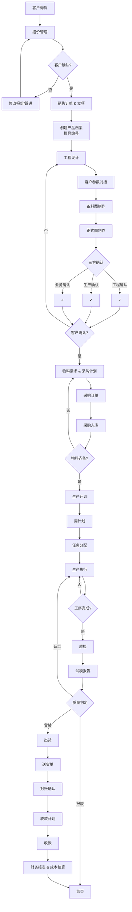
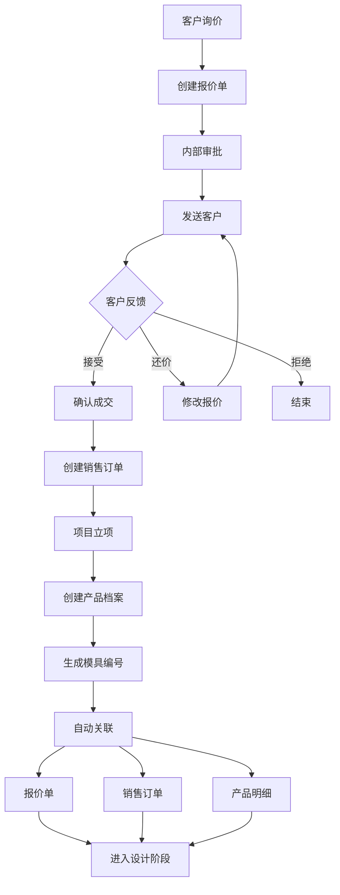
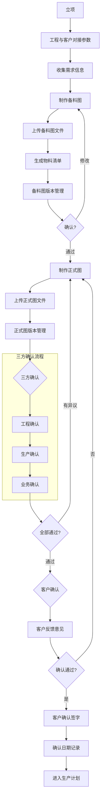
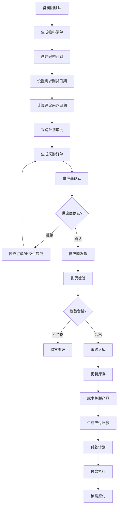
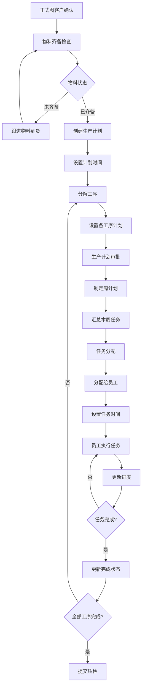
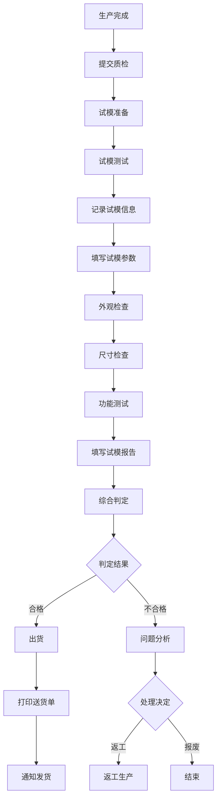
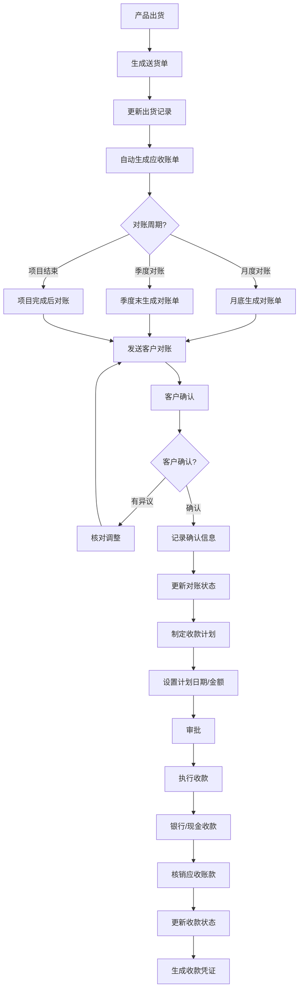
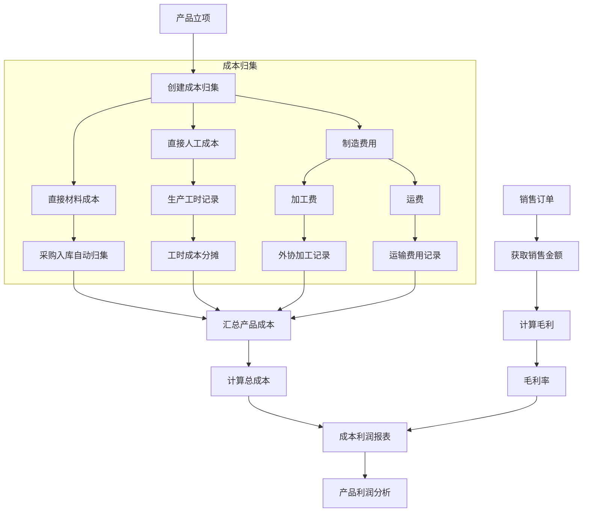

# 德川/裕霖业务管理系统 - 程序流程图

> 说明：以下流程图使用Mermaid语法编写，可复制到支持Mermaid的工具中查看（如：https://mermaid.live/、Notion、VS Code等）

---

## 1. 整体业务流程图



---

## 2. 销售与立项流程



---

## 3. 图纸设计确认流程



---

## 4. 采购流程



---

## 5. 生产计划流程



---

## 6. 质检与试模流程



---

## 7. 应收收款流程



---

## 8. 成本核算流程



---

## 绘制工具推荐

### 在线工具
1. **Mermaid Live Editor** - https://mermaid.live/
   - 直接粘贴代码即可生成流程图
   - 支持导出PNG、SVG格式

2. **Draw.io (diagrams.net)** - https://draw.io
   - 图形化界面拖拽绘制
   - 支持导出多种格式

3. **ProcessOn** - https://www.processon.com/
   - 中文界面
   - 协作功能强

### VS Code 插件
- **Mermaid Markdown Syntax Highlighting** - 语法高亮
- **Markdown Preview Mermaid Support** - 预览效果

### 绘图技巧

```
1. 流程图元素规范：
   - 开始/结束：圆角矩形
   - 处理步骤：矩形
   - 判断/分支：菱形
   - 输入/输出：平行四边形
   - 连接线：箭头

2. 流程图布局原则：
   - 从上到下，从左到右
   - 主流程走主线，分支走两侧
   - 保持流程清晰，避免交叉

3. Mermaid常用符号：
   - flowchart TD: 从上到下流程图
   - flowchart LR: 从左到右流程图
   - subgraph: 子流程
   - -->: 连接线
   - {|}: 判断条件
```

---

## 文件说明

本文件包含8个核心业务流程的流程图：
1. 整体业务流程图
2. 销售与立项流程
3. 图纸设计确认流程
4. 采购流程
5. 生产计划流程
6. 质检与试模流程
7. 应收收款流程
8. 成本核算流程

将代码复制到 Mermaid Live Editor 中即可查看图形化流程图。
